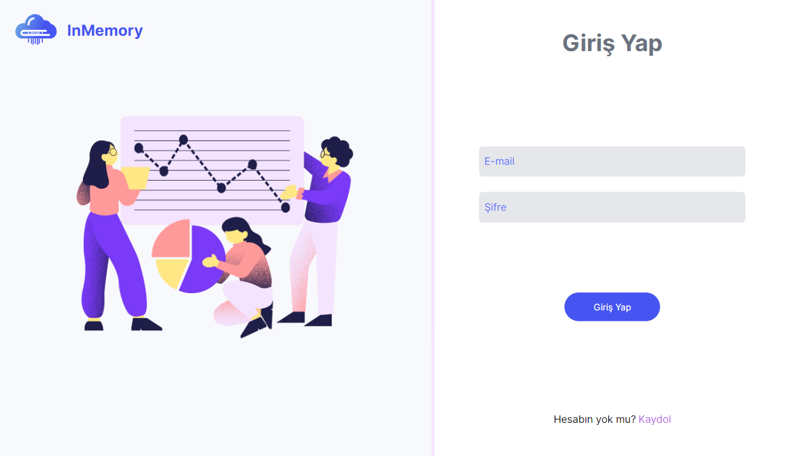
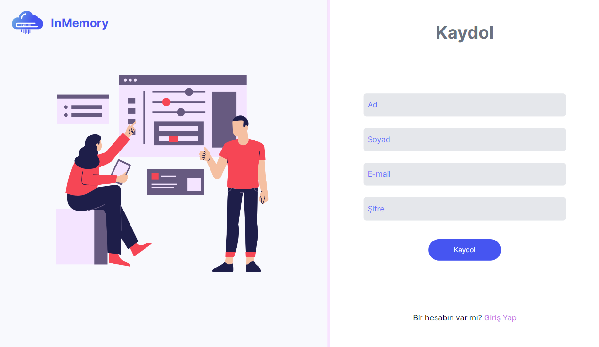
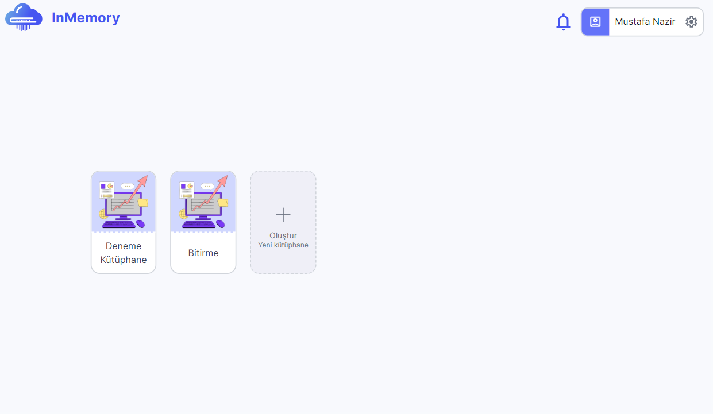
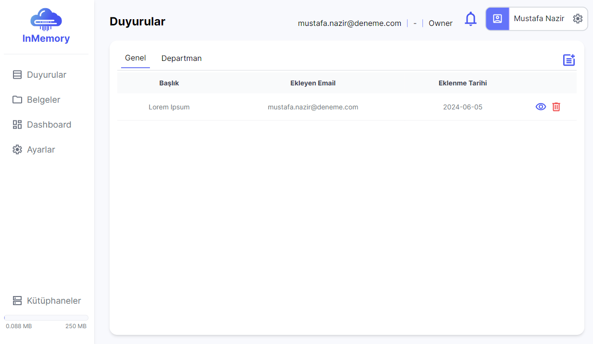
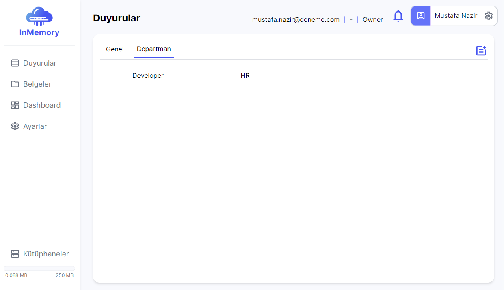
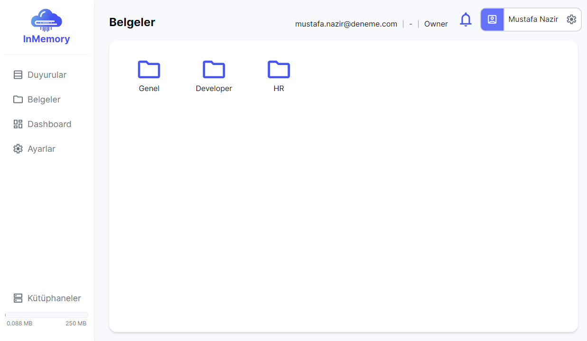
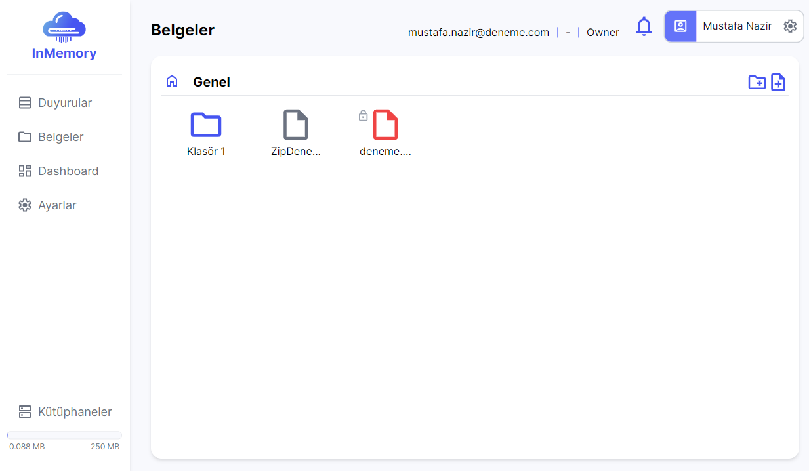
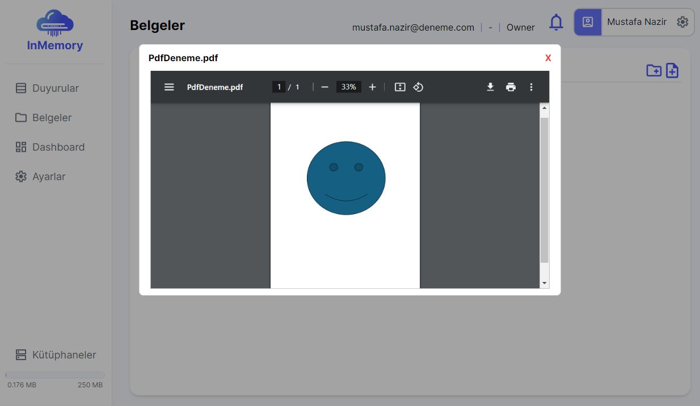
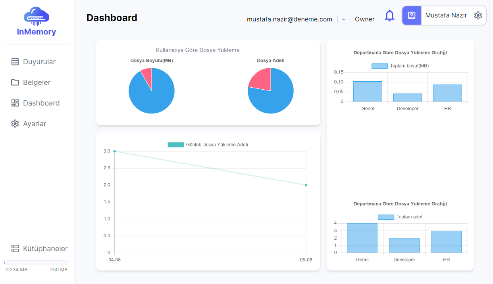
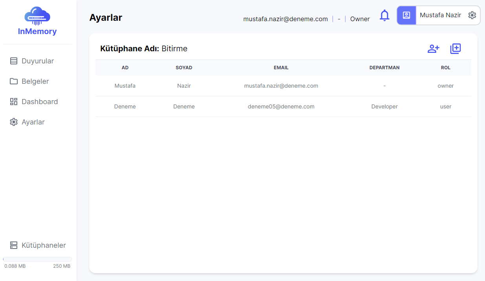

# 📄About The Project
This project is a **SaaS** application that allows institutions to store and manage their data.

# 💻Used Technologies
|Technologies|
|:---:|
|Next.js|
|React|
|Tailwind CSS|
|Redux|
|TypeScript|
|Git|

# 🔑Features
* Login/Register
* Every user can create their library and invite their team members.
* A notification is sent to users to accept or reject the library invitation.
* The project has role and department-based authorization. There are three roles in the project (owner, admin, user), and departments can be created dynamically.
* Users can create announcements and share them publicly or within their department.
* Users can create folders in the public or department folders and upload their files.
* The dashboard section has a daily file upload graphic, as well as graphics showing file size and amount by user and department.
* The owner role can see all department folders, files, and announcements, and can delete any file or announcement.
* The admin and user roles can see only their department's folders, files and announcements. Admins can delete them, while users can delete only their own.
* The user roles can't access the dashboard and settings sections.

# 📋UI

## Login

## Register

## Library Selection

## Announcements
### Public Announcements

### Department Announcements

### Adding New Announcement

## Files

### Folder Selection (public or department folder)

### Public Folder

### PDF Preview

## Dashboard

## Settings

